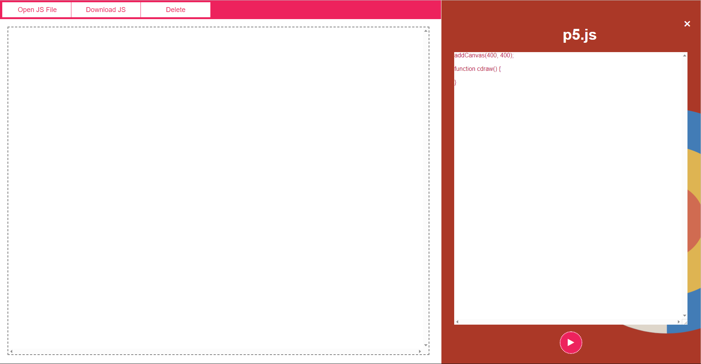

# Infinity p5
A straightforward online p5.js editor that simplifies the p5 process.  
Infinity p5 also possesses a preview div that shows the code in action when the execute button is pressed.
  

  
## Features
- Editor box
- Preview of code in action
- Ability to execute code
- Built-in console that responds to Window.console (conditions apply)
- Ability to download/open/delete a js file

**Currently, version 1.0.0 of Infinity p5 lacks syntax highlighting.**
  
## Peek at the editor in action

**Try the editor out yourself!**
  
## Console (v1.0.0)
- Editor has built-in console that reponds to console.log() and console.clear(), but not the rest (e.g. console.err())
  

   

**Try the Infinity p5 out yourself!**

**Also, don't forget that this editor has an HTML editor sibling: [Repo: Infinity Peasy](https://github.com/amolgorithm/infinity-peasy)**
